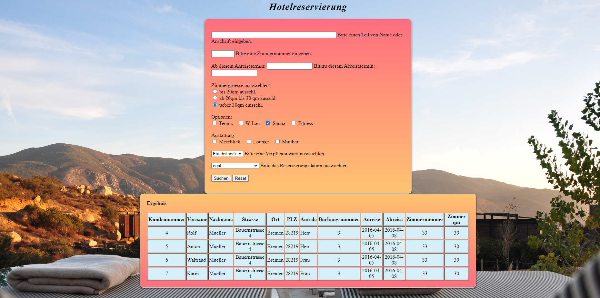

# 🏨 Hotel Reservation Application

This application allows users to search and view hotel reservations. It was developed using PHP and MySQL.



## Requirements

- PHP 
- MySQL
- Web server (e.g., Apache)

## Installation

1. Clone the project to your web server directory or upload the files.
2. Create a MySQL database and import the SQL file `db_hotelreservierung.sql` included in your project folder.
3. Adjust the database connection information in the `hotelreservierung.php` file:

   ```php
   $dbhost = 'localhost';
   $dbuser = 'root';
   $dbpass = '';
   $dbname = 'your_database_name';

## Usage
On the application's homepage, users can search for hotel reservations by selecting various filters and search criteria.
Results are displayed in a table, and users can view details of the found reservations.
